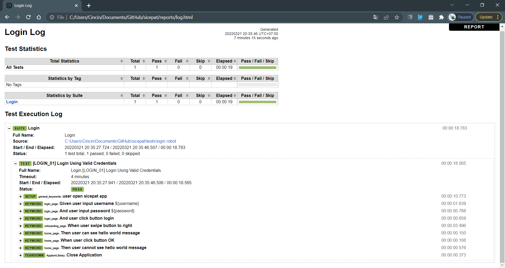

# Sicepat-test
 
Setup
1. Install Python 3.*
2. Install Robot Framework 
3. Install AppiumLibrary
4. Change emulator-5554 at Sicepat-test/frameworks/app_config.robot to udid of device

How To Run
1. cd Sicepat-test
2. robot -d reports tests\login.robot

Report Files 
1. Open Sicepat-test/reports directory
2. Open log.html using browser 

Reports
